# Laplace user guide

Laplace is a private research and engineering workspace. Its normal browser login uses a registered email, password, and opaque server-side session; it does not ask you to paste an API token. Model inference and indexed-document processing remain on the configured local machine.

The screenshots below contain synthetic fixture data. They contain no live credentials, activation codes, private paths, or unrelated user information.

## v2 developer and Codex workflow

The standalone `LaplaceCore` can run without MCP. For authenticated repository
work, Zetsu is the optional Codex adapter over the same Core services. The normal
development topology intentionally disables CodeV:

```bash
cd /home/giando/work/laplace-v2
laplace zetsu start --nocodev
laplace zetsu status --json
laplace zetsu sessions --json
```

From a canonical administrator-registered and authorized project, use:

```bash
cd <registered-project>
laplace zetsu
laplace zetsu codex
```

Status separates MCP/model readiness from repository readiness. A repository
must be registered and granted to the authenticated principal before
`agent_task_ready` becomes true. The precise authorization errors are
`repository_not_registered` and `repository_not_authorized`. A committed canonical HEAD advance is safely
synchronized for a new isolated session; caller-only dirty files are never copied.
Clean failed/expired sessions are reclaimed before quota denial, while dirty
worktrees remain recoverable. See [ZETSU.md](ZETSU.md) and
[AGENT_WORKTREES.md](AGENT_WORKTREES.md).

### Persistent terminal agent

`laplace chat` is the terminal UI for the same resident Operator—not a second
agent runtime. From a registered project, start it after the normal lightweight
topology is ready:

```bash
laplace zetsu start --nocodev
cd <registered-project>
laplace chat --repo-id <logical-repository-id>
```

The default `agent` mode creates one remote session on the first instruction and
reuses it through `/messages` on later instructions. Use `/mode chat` only for
an optional plain `LaplaceCore.chat` conversation; `/mode agent` returns to the
same persistent repository agent. `/status`, `/diff`, `/tests`, `/context`, and
`/history` use deterministic Operator data and cause zero monitoring model
calls. Exit and resume with `laplace chat --resume last`; both the local terminal
state and its remote session ID are root/repository checked. See
[LAPLACE_CHAT.md](LAPLACE_CHAT.md) for command and token details.

### Governed self-improvement

Use `laplace-maintenance` when you want to turn bounded trajectory and memory
evidence into reviewable improvement proposals. It is intentionally shadow-only:
it cannot edit code, activate a skill, change routing, or promote itself. The
complete cycle, frozen A/B evidence format, held-out requirement, and human
approval workflow are in [SELF_IMPROVEMENT.md](SELF_IMPROVEMENT.md).

## 1. Open Laplace

For local use, open `http://127.0.0.1:8765`. Through an SSH tunnel, open the same URL on your client. For production HTTPS, use the exact URL supplied by the administrator.

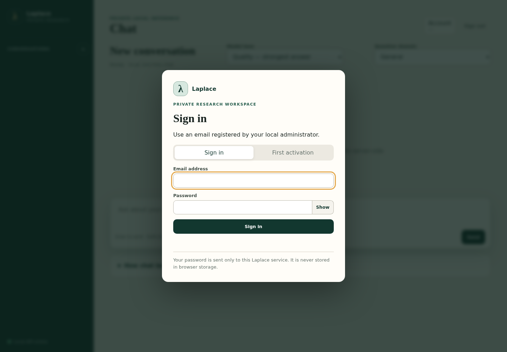

The page shows a red persistent warning if an administrator explicitly enabled insecure non-loopback HTTP. Do not enter a password in that mode unless you understand the network risk.

## 2. First activation

The first account is registered as `afasolino@unisa.it`, with Operator capability, the `admin` role, and Quality as its default lane. The password is not predefined.

1. Ask the local administrator to run the bootstrap command in [ADMIN_GUIDE.md](ADMIN_GUIDE.md).
2. Keep the terminal open: the one-time activation code is printed there once.
3. Select **First activation** in the login dialog.
4. Enter `afasolino@unisa.it`, the one-time code, and a new password.
5. Select **Activate account**.

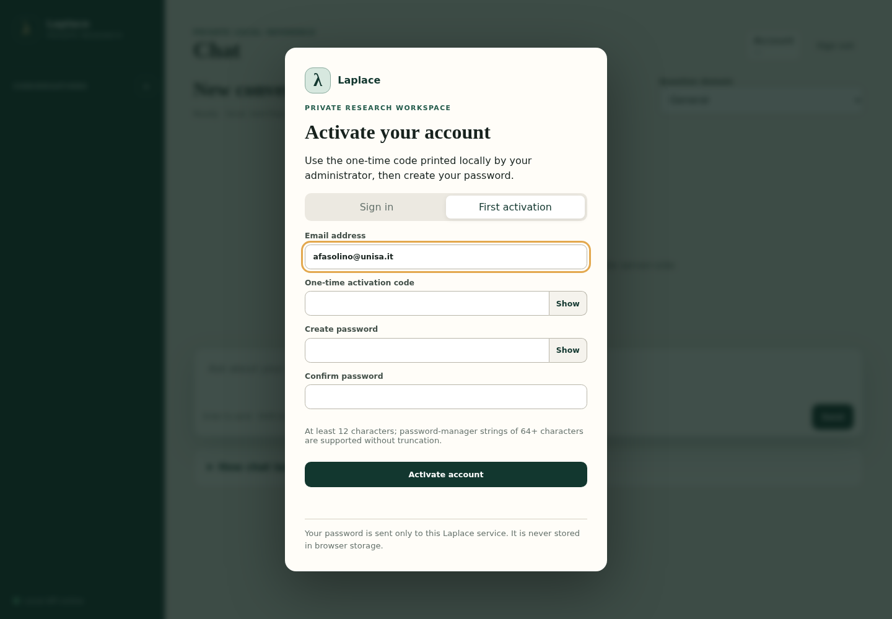

The code stops working after successful activation or after the administrator bootstraps/resets the account again. Laplace accepts password-manager values longer than 64 characters without truncation.

`frcapone@unisa.it` is activated through the same screen with a separate one-time code. It is a normal user account with Chat, Agent, and personal-corpus capabilities; it has no administrative access and no repository until an administrator grants one.

## 3. Sign in and sign out

Enter the registered email and password, then select **Sign in**. Email matching trims surrounding whitespace and ignores case. Authentication failures are deliberately generic.

Use **Sign out** for the current browser session. Open the account panel and select **Sign out all sessions** to revoke every active session for your account. An expired or revoked session returns to the login dialog while keeping the unsent composer text on screen.

## 4. Change the password

Open the account button in the top-right corner, expand **Change password**, enter the current and new passwords, then submit. A successful change rotates the session identifier and revokes prior sessions. A normal change always requires the current password.

## 5. Start a chat

Select **Chat**, enter a question, and press **Enter** or select **Send**. Use **Shift+Enter** for a newline. Chat calls are tool-free: the model receives no dormant repository, file, shell, or mutation tool schemas.

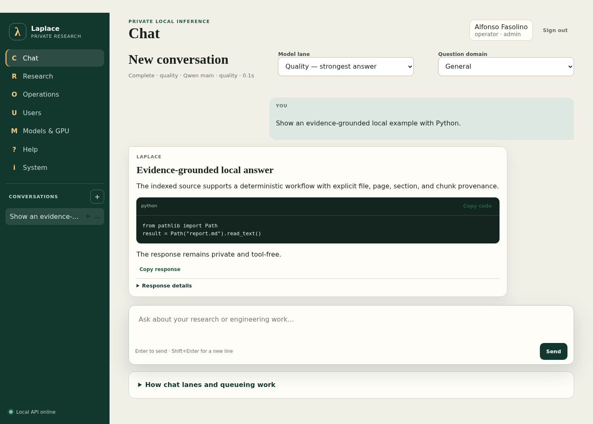

Assistant Markdown is treated as untrusted. Laplace escapes embedded HTML, rejects unsafe link schemes, and constructs the rendered view with DOM text nodes. Copy buttons are available for the response and each fenced code block.

## 6. Select Quality, Standard, or Economy

- **Quality** prioritizes the strongest local route and reserves capacity so it is not starved.
- **Standard** balances quality and response time.
- **Economy** uses an eligible faster route. The CodeV specialist is eligible only for RTL/SystemVerilog work; non-RTL work never routes to CodeV.

The server-provided domain registry exposes **Auto / General**, **Python**, **Structured JSON**, and **SystemVerilog** only on surfaces that actually implement them. Auto / General is the Chat/Research default. Python and SystemVerilog are the Agent domains. Each option describes eligible routes and deterministic validation; an indexable file extension alone never creates an Agent domain.

Capability and quality are independent. A chat-only account may still select any permitted quality lane.

The selector is built from `/api/v1/providers`. The response contains provider
capabilities plus logical provider/model route IDs, but not endpoints, credentials or
ports. A route appears only when enabled. Agent uses the same provider catalog, so
Chat and Agent cannot drift into separate frontend routing vocabularies.

## 7. Understand queue and response details

During a request, the status progresses through queued, running, complete, cancelled, or failed. **Stop** cancels the browser request; deterministic failure messages explain whether the draft can be retried.

Expand **Response details** to inspect the request and trace IDs, requested/effective lane, model display name, queue wait and position, context/output limits, finish reason, token usage when supplied, and any single bounded escalation. Raw JSON exists only in a separate Operator-only debug disclosure.


## 8. Manage conversations

Conversation history is stored server-side per user. Use **+** for a new conversation. Open the actions menu beside an item to rename, archive/reopen, or delete it. A draft is periodically saved to the active conversation; another user cannot list or open it.

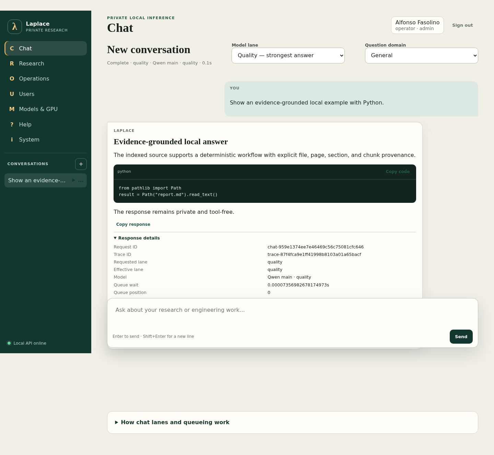

Use **Retry** after a transient failure. Regeneration sends the preserved user request through the selected lane again and records a new request identity.

## 9. Upload a personal reference folder

Open **Knowledge**, create a corpus, then select a folder, drop files/folders, or choose a controlled ZIP. Select **Preview selected folder** and inspect every acceptance decision before selecting **Index accepted files**. The source cards show logical name, type, size, short hash, owner, storage class, retention, indexing state, download, and delete.

Interrupted staging can resume after reload by reselecting the same files; no file content is kept in browser storage. Deletion removes indexed chunks from retrieval immediately, then applies the configured soft-delete policy. See [PERSONAL_CORPUS.md](PERSONAL_CORPUS.md).

## 10. Select retrieval sources

Chat and Agent provide **No retrieval**, **My personal corpus**, **Shared governed corpus**, **Both permitted corpora**, and **Selected personal corpus**. Response details report what was requested and what was actually used, including snapshot revision and file/page/section/chunk citations. Content still in staging is never used.

Personal context is read-only to Agent and is not mounted in a repository. Shared governed retrieval remains a separate pipeline in this release; when it is requested but unavailable in the tiered path, response details say `retrieval_used=false`.

## 11. Use the repository agent

Only Plus capability exposes the Agent workspace. Select a repository from the
server-populated list—there is no filesystem-path field—choose a lane, enter a
bounded task, and select **Send to persistent agent**.

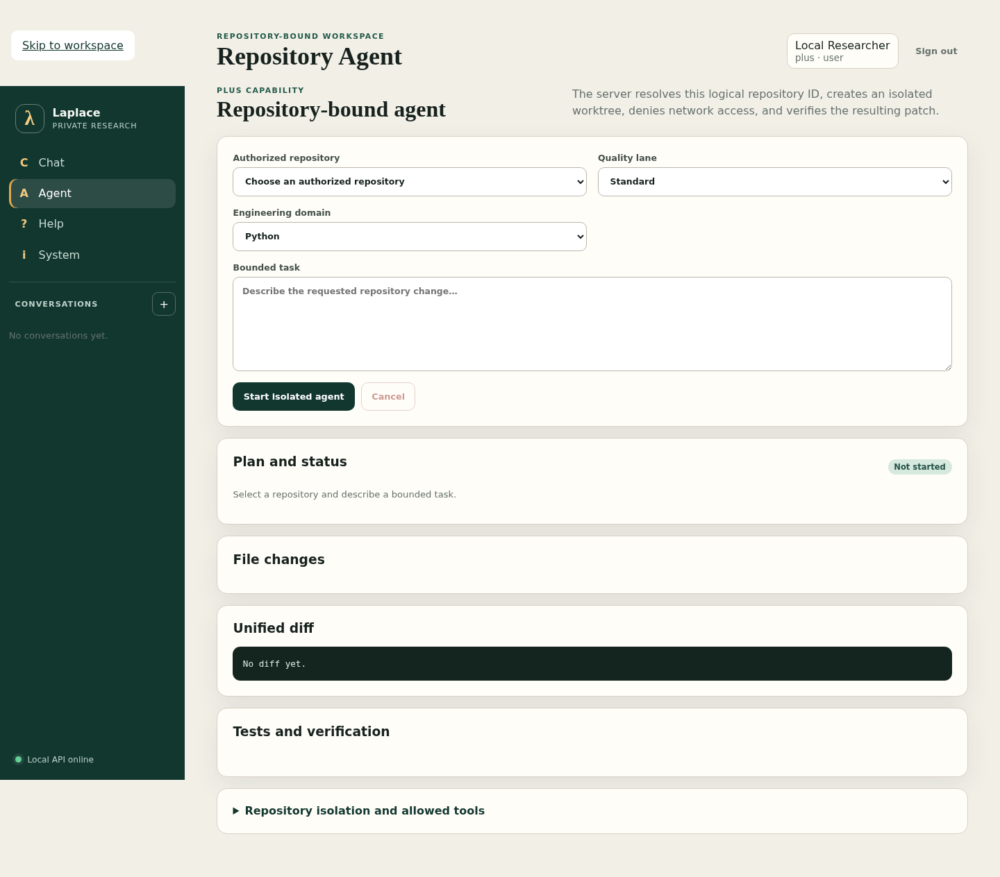

The first send binds one session to the authenticated user, logical repository
ID, canonical server-owned repository root, base revision, isolated worktree,
and tool policy. Later messages reuse that exact session and worktree, so the
agent retains the verified worktree context instead of starting a new task for
each prompt. Use **New session** only for a deliberately separate task. The
server transcript is durable and owner-bound; **Resume** in the worktree history
returns to the same session after a page reload.

Read-only inspection is the default. To allow an edit, select **Allow bounded
edits after confirmation**, supply a deterministic verification argv one argument
per line (for example `pytest`, `-q`, and a test path), and tick the explicit
confirmation for that turn. The server validates argv without a shell and refuses
all mutation actions until a qualifying verifier is pinned. Network access is
denied. Absolute paths, traversal, links, mounts, nested repositories,
submodules, sibling worktrees, and changed grants fail closed.

If the repository list is empty, ask an administrator to register and grant a logical ID. After a grant or revoke, sign in again because the access change closes existing sessions.

## 12. Manage worktrees and verification

The result separates the plan/status, changed-file summary, unified diff, and test/verification outcomes. There is no browser shell.

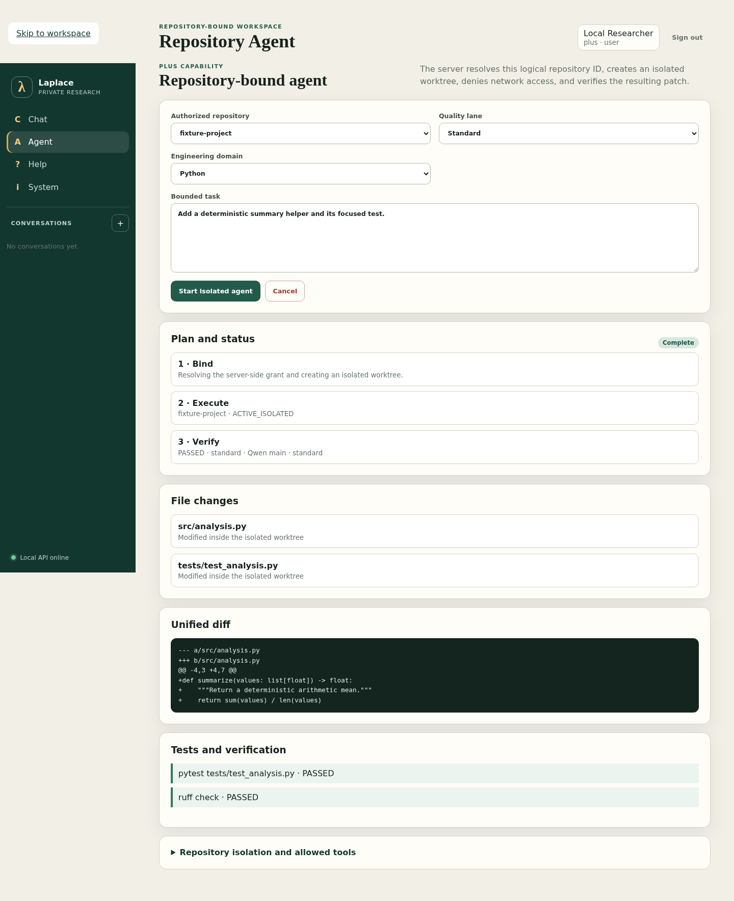

Use **Status**, **Diff**, **Tests**, and **Context** to inspect deterministic
session state. They make no model call. Diff is loaded as an owner-bound bounded
result page rather than reconstructed by a model. **Cancel** uses the existing
Operator cancellation endpoint to block further work and release a clean
Laplace-owned worktree. A dirty worktree is preserved for inspection rather than
silently discarded.

The history view supports resume, clean close, export request, patch download, event history, and confirmed discard. It shows logical IDs, commit/grant revision, state, changed paths, diff hash, verification, and expiry without canonical paths. See [AGENT_WORKTREES.md](AGENT_WORKTREES.md).

## 13. Start and cancel Deep Research

Operator-capable accounts can select **Research**, enter a question and scope, choose a research mode, source policy, and available backend, then create a job. Laplace admits at most two research jobs globally and one per user; the interface shows a queue reason and position.

Select **Run admitted job** when capacity is available. Select **Cancel** for a queued or running admission record. Cancellation does not authorize termination of unrelated work.

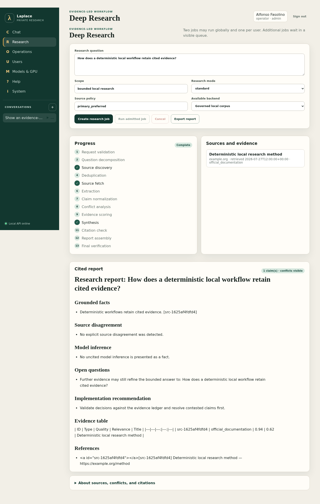

## 14. Read citations and evidence

The research view separates stage progress, source title/domain/retrieval time/type, claim and evidence information, conflicts, and the cited report. Local source storage paths are not shown. Indexed-document answers retain file, page, section when available, and chunk identifiers in their evidence records.

Conflicting sources remain visible. Exploratory research is not promoted into governed knowledge or a measured run automatically.

## 15. Download artifacts

Select **Export report** after research completes. Laplace registers an internal ULID, owner pseudonym, content hash, source fingerprint, model route, lineage, visibility, and authorization policy. The browser receives a clean filename and clean report content, not internal provenance.

Every read/export verifies the stored SHA-256. A mismatch is rejected as `artifact_integrity_failure`. Cross-user and cross-repository reads return a not-found response.

## 16. Inspect available functionality

**Help** lists only functions available to the authenticated capability. **System** shows the application/Git/API versions, role, capability, sanitized provider and lane display names, provider/model route IDs, tool support, context/output limits, guardrails, deployment mode, and documentation names. It never shows a provider endpoint.

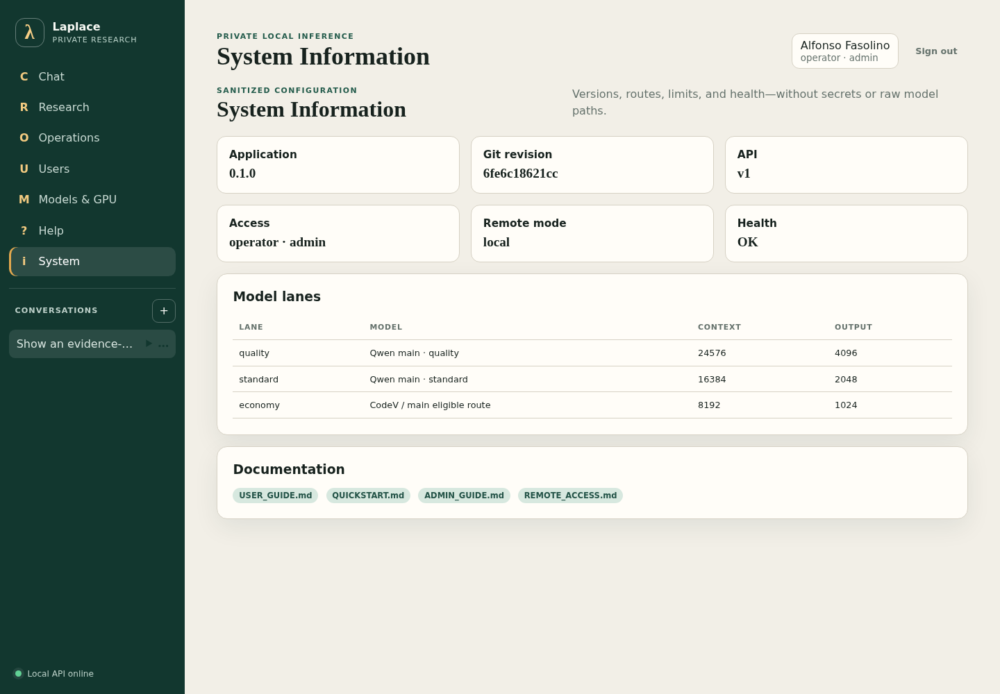

Navigation is derived from independent effective capabilities, not an exact tier. Basic defaults to Chat. Plus defaults to Chat, Agent, and personal corpus. Operator defaults to administrative functions; Agent and personal corpus can be combined independently.

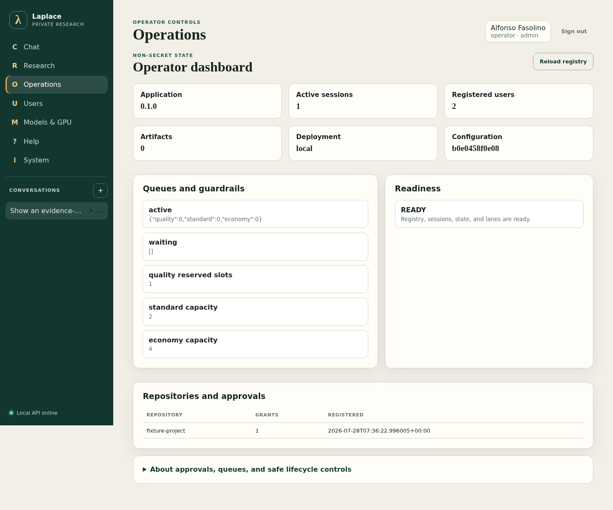

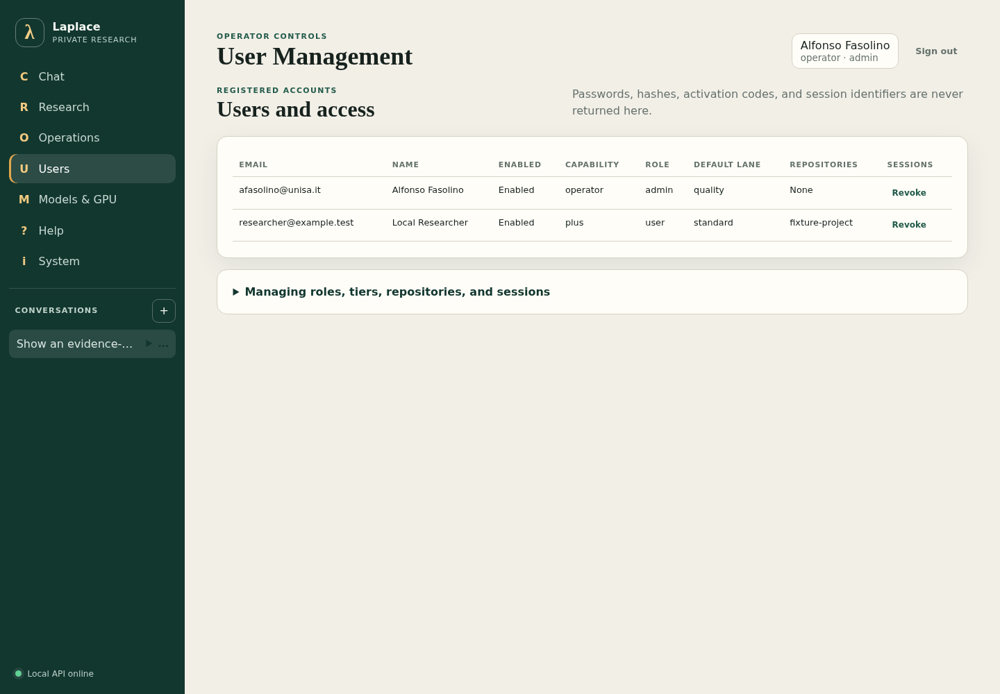

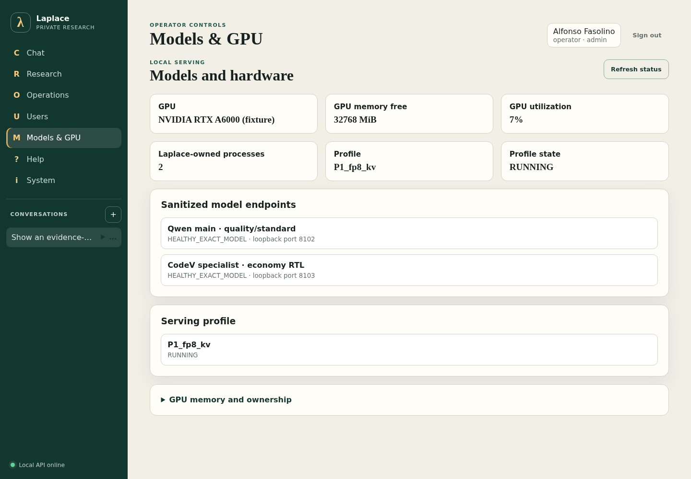

## 17. Interpret errors

- **Session expired/revoked:** sign in again; the visible unsent draft is preserved.
- **Repository not authorized:** ask an administrator to grant the logical repository ID.
- **Stale grant:** create a new worktree after the administrator restores or updates authorization.
- **Worktree quota:** close a clean worktree or export and explicitly discard a retained one.
- **Corpus quota/disk pressure:** cancel staging and ask an Operator to review policy and protected free space.
- **Queued/capacity guardrail:** wait for the displayed admission state to change.
- **Model unavailable:** keep the draft and ask an Operator to inspect readiness.
- **Validation failed:** inspect the friendly reason; escalation is bounded to one Quality retry.
- **Artifact integrity failure:** do not use the file; ask an Operator to inspect provenance events.
- **Trace ID shown:** include only that ID—not a password or document content—in a support request.

See [TROUBLESHOOTING.md](TROUBLESHOOTING.md) for operator diagnostics.

## 18. Privacy, isolation, and provenance

Laplace distinguishes your own work from external literature in source metadata. Browser storage contains no password, bearer token, session ID, or refresh token. The `laplace_session` cookie is HttpOnly, so JavaScript cannot read it.

Conversation messages, drafts, attachments, personal sources, shared knowledge, repository files, worktrees, artifacts, and audit logs have separate lifecycle rules. The GUI Help/Account/System views and [STORAGE_AND_RETENTION.md](STORAGE_AND_RETENTION.md) explain ownership, logical location, indexing, deletion, retention, and access. Normal users cannot enumerate another user's corpus names, filenames, hashes, chunks, or owner pseudonyms.

## 19. Remote access through SSH or HTTPS

The fastest safe remote method is:

```bash
ssh -L 8765:127.0.0.1:8765 <server>
```

Then open `http://127.0.0.1:8765` locally. For multi-user production access, use the documented Caddy or Nginx TLS reverse proxy while Uvicorn and both model ports remain bound to loopback. See [REMOTE_ACCESS.md](REMOTE_ACCESS.md).

## 20. Safe shutdown

Stop the Operator service first, then invoke the repository-owned model lifecycle stop command or systemd unit. Laplace validates recorded ownership before signalling a model PID and never force-kills a process after a graceful timeout.

```bash
sudo systemctl stop laplace-operator
sudo systemctl stop laplace-model-servers
```

For a manual session, press `Ctrl+C` in the Operator terminal, then use the documented owned-profile stop command. Do not use `pkill`, broad GPU process matching, or a command that closes the shell/tmux session.

Screenshot regeneration:

```bash
PYTHONPATH=src .venv/bin/python scripts/capture_user_guide_screenshots.py
PYTHONPATH=src .venv/bin/python \
  scripts/capture_agent_personal_corpus_gui_v6_screenshots.py
```

The v6 fixture set includes [domain selection](user_guide/assets/domain_selector.png), [no-repository state](user_guide/assets/agent_no_repository.png), [new worktree](user_guide/assets/agent_new_worktree.png), [worktree history](user_guide/assets/agent_worktree_history.png), [Agent progress](user_guide/assets/agent_progress.png), [empty personal corpus](user_guide/assets/personal_corpus_empty.png), [upload manifest](user_guide/assets/folder_upload_manifest.png), [indexed corpus](user_guide/assets/personal_corpus_indexed.png), [retrieval selector](user_guide/assets/retrieval_source_selector.png), [Chat processing](user_guide/assets/chat_processing_state.png), [mobile Markdown table](user_guide/assets/markdown_table.png), and [independent capability controls](user_guide/assets/admin_capabilities.png).

## Repository synchronization boundary

Select only a Git top-level for repository synchronization. Laplace shows the
branch, HEAD, tracked changes, excluded untracked files, and exact approval before
export or apply. Incoming apply requires the expected branch and a clean target.
A normal folder is never treated as a repository; upload it through Personal
corpus so file validation, quarantine, ownership, indexing, and citations apply.

## Zetsu and Codex

For Codex-driven work, Zetsu exposes the same authenticated Laplace boundaries
through MCP. A fresh repository is onboarded by running bare `laplace zetsu` from
that repository; it configures managed content when needed and runs status plus
the retrieval connectivity test. The managed project Skill tells Codex when to
work locally, retrieve compact evidence, delegate bounded reasoning to Qwen,
start a Qwen repository `agent_task`, or use CodeV `rtl_task` for eligible
RTL/SystemVerilog work. The process that starts Codex must still receive the
configured bearer-token environment variable.

For the local development deployment, `laplace zetsu start --nocodev` starts the
selected Qwen profile and the Operator and waits for both to become ready. Thereafter,
bare `laplace zetsu` from any project performs
configure-if-needed, status, and the authenticated retrieval test. The matching
`laplace zetsu stop` command stops only supervisors recorded with matching owned
process identities.

The full CodeV topology is reserved for an explicit RTL experiment or operator
action. C8 currently records the SiliconMind comparison as `BLOCKED` because its
candidate artifact and certified full-topology vLLM executable are absent; no model
route was promoted.

Use `laplace zetsu codex` to start a new Codex session after the same live
preflight. It loads the loopback bearer credential from the protected Operator
token file into the Codex child environment without printing it or persisting it
in Codex configuration.

Qwen repository-agent sessions use a server-authorized isolated worktree and
owner-scoped retrieval. They have no generic shell/network access and require
post-mutation deterministic verification before successful completion. Remote
user folders remain governed by the explicit Laplace Client pair/grant flow. See
[ZETSU.md](ZETSU.md) and [LAPLACE_CLIENT.md](LAPLACE_CLIENT.md).
